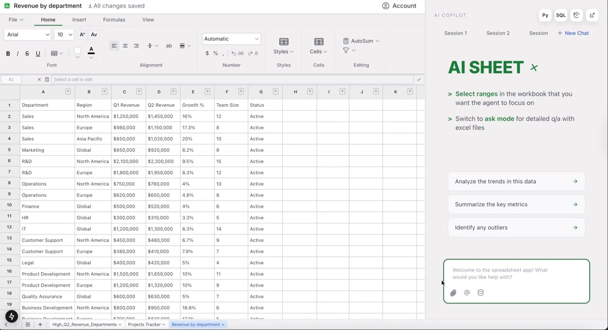
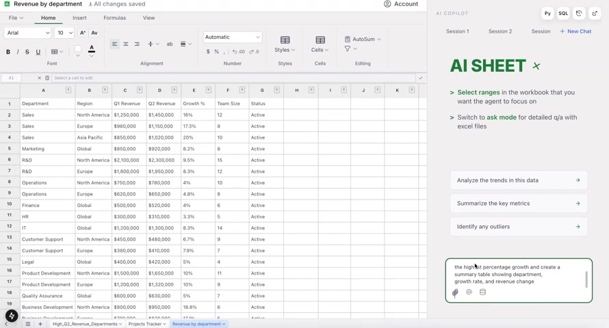
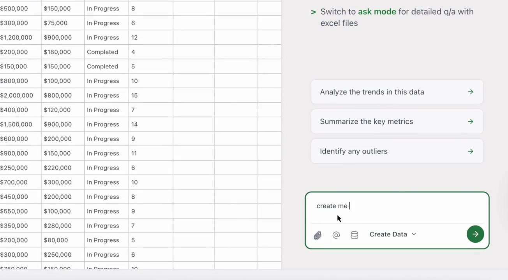
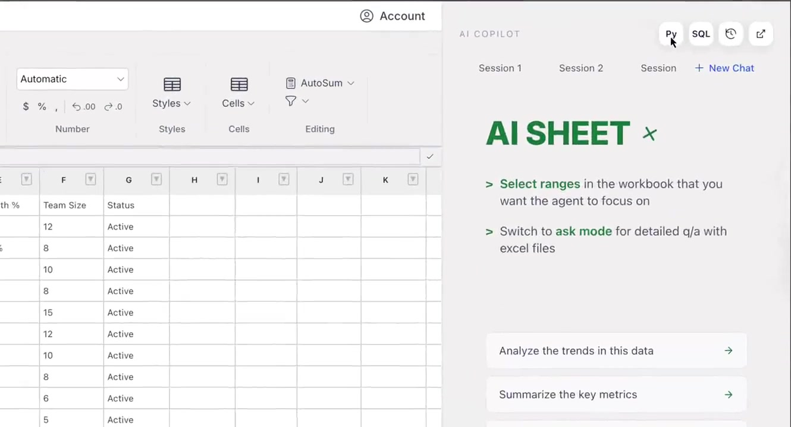

# 
Motion Excel

**An AI-Powered Spreadsheet Application Built with CopilotKit. Extensible. High-performance. Embedded to your application.**

[Official Site](#) | [Documentation](#) | [Online Playground](https://spreadsheet-demo-tau.vercel.app/) | [Blog](#)

 

  <strong>Use Motion Excel to build AI-powered spreadsheets with natural language and create intelligent, data-driven applications.</strong>

 

.mp4)

**Click the image above to watch the dashboard demo video**

---

## **Table of contents**

- 🌈 [Highlights](#-highlights)
- ✨ [Features](#-features)
  - 📊 [Spreadsheet Features](#-spreadsheet-features)
  - 🤖 [AI Copilot Features](#-ai-copilot-features)
  - 🔧 [Technical Features](#-technical-features)
- 🚀 [Getting Started](#-getting-started)
- 📖 [Documentation](#-documentation)
- 🔮 [Showcase](#-showcase)
- 🌐 [Internationalization](#-internationalization)
- 🔒 [Security](#-security)
- 💬 [Community](#-community)
- 🤝 [Contribution](#-contribution)
- ❤️ [Sponsors](#-sponsors)
- 📄 [License](#-license)

---

## 🌈 **Highlights**

- 📈 **Motion Excel is designed to support spreadsheets with AI-powered assistance and natural language commands.**
- 🧙‍♀️ **Motion Excel is isomorphic.** It can run both on browsers and Node.js (in the future, mobile devices as well), with the same API.
- ⚙️ **Motion Excel is easily embeddable**, allowing seamless integration into your applications.
- 🌟 **Motion Excel is powerful**, offering a wide range of features including **formulas, conditional formatting, data validation, filtering, collaborative editing, printing, import & export** and more features on the horizon.
- 🔌 **Motion Excel is highly extensible**, thanks to its **plug-in architecture** that makes it a delight for developers to customize and extend.
- 🎨 **Motion Excel is highly customizable**, allowing you to personalize its appearance using *themes*.

---

## ✨ **Features**

### 📊 **Spreadsheet Features**

- **Zen Editor**: Offers a distraction-free editing experience with a clean interface.
- **Formulas & Functions**: Supports a wide range of Excel-compatible formulas.
- **Cell Formatting**: Bold, italic, underline, colors, and more.
- **Data Validation**: Set input constraints and validation rules.
- **Row & Column Operations**: Insert, delete, resize with ease.
- **Copy & Paste**: Standard clipboard operations.
- **Import & Export**: Support for XLSX format.
- **Printing**: Print spreadsheets or export to PDF.
- **Charts**: Bar charts, line charts, pie charts, scatter plots.
- **Collaborative Editing**: Real-time collaboration support (Coming Soon).

### 🤖 **AI Copilot Features**

- **Natural Language Commands**: Build spreadsheets using plain English.
- **Intelligent Formula Suggestions**: Context-aware recommendations.
- **Automated Spreadsheet Generation**: Create from descriptions.
- **Data Analysis Assistance**: AI-powered insights.
- **Research Agent Integration**: Web-integrated data gathering.
- **Code Execution**: Python & SQL within spreadsheets.

### 🔧 **Technical Features**

- **Modern Tech Stack**: Next.js 15, React 18, TypeScript.
- **Docker Service**: Isolated code execution.
- **WebSocket Support**: Real-time capabilities.
- **Plugin Architecture**: Extensible design.

---

## 🚀 **Getting Started**

Looking to get started with Motion Excel?

Please refer to our [**Documentation**](#) for detailed installation and usage instructions.

> **Note**: For code execution features, a Docker environment is required.

---

## 📖 **Documentation**

- [**CopilotKit Documentation**](https://docs.copilotkit.ai/getting-started/quickstart-chatbot) - Learn about CopilotKit features and API
- [**Tutorial: Building an AI-Powered Spreadsheet**](https://dev.to/copilotkit/build-an-ai-powered-spreadsheet-app-nextjs-langchain-copilotkit-109d) - Step-by-step guide

---

## 🔮 **Showcase**

Embed Motion Excel in AI products as a data presentation tool.

|  |  |
|:---:|:---:|
| **AI-Powered Analysis** | **Data Creation** |
| Click to watch | Click to watch |

 

|  |  |
|:---:|:---:|
| **SQL Queries** | **Python Analysis** |
| Click to watch | Click to watch |

 

You can find all the examples in the **[Motion Excel Examples](#)**.

---

## 🌐 **Internationalization**

Motion Excel supports multiple languages:

- 🇺🇸 English
- 🇨🇳 简体中文 (Coming Soon)
- 🇯🇵 日本語 (Coming Soon)
- 🇪🇸 Español (Coming Soon)

---

## 🔒 **Security**

Motion Excel is committed to maintaining a secure codebase. We follow best practices for security and regularly update our dependencies.

For more information, please refer to our [Security Policy](./SECURITY.md).

---

## 💬 **Community**

Motion Excel is an inclusive and welcoming project. Please read our [Code of Conduct](./CODE_OF_CONDUCT.md) before participating in the community.

**Join the Univer community:**

- Chat with us and other developers on [Discord](https://discord.gg/6dffbvGU3D).
- Start a discussion on [GitHub Discussions](https://github.com/CopilotKit/motion-excel/discussions).
- Open a topic on [Stack Overflow](https://stackoverflow.com/questions/tagged/motion-excel) and tag it with `motion-excel`.

You can also find us on:
[Twitter](https://twitter.com/motionexcel) | [YouTube](#)

---

## 🤝 **Contribution**

We appreciate any kinds of contributing. You can submit [issues or feature requests](https://github.com/CopilotKit/motion-excel/issues) to us. Please read our [contributing guide](./CONTRIBUTING.md) first.

If you would like to contribute code to Motion Excel, please refer to the [contributing guide](./CONTRIBUTING.md) as well.

---

## ❤️ **Sponsors**

The growth and development of the Motion Excel project rely on the support of its backers and sponsors. If you are interested in supporting our project, we kindly invite you to consider becoming a sponsor.

---

## 📄 **License**

Copyright © 2025 Motion Excel Contributors. All Rights Reserved.

Licensed under the [MIT License](./LICENSE).

---
